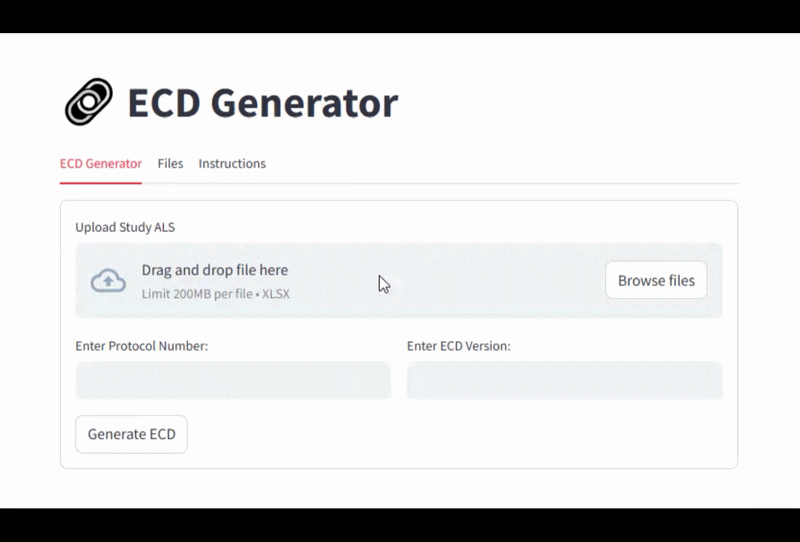
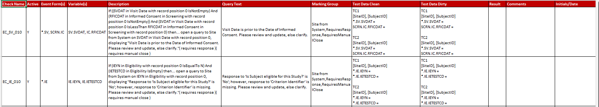

# ECD Generator

**Automated UAT Test Script Generation for Medidata Rave Study Builds**

ECD Generator (Edit Checks and Derivations Generator) is a clinical study-build automation tool that generates structured UAT validation scripts from a Medidata Rave Architect Loader Spreadsheet (ALS).

The project was inspired by seeing a similar automation approach used in another clinical data environment. Recognizing that the same general concept could improve a manual UAT-preparation workflow in my organization, I independently designed and developed ECD Generator for that context.

The application interprets study-build information and produces a standardized Excel validation workbook covering key programmed behavior within a Rave study.

During testing, a process that typically required approximately **one working day of manual preparation was completed in less than three minutes**.

> **Portfolio case study:** This repository documents the application, workflow, conceptual architecture, and representative outputs. The production source code and generation logic are not publicly distributed. Public examples use synthetic or sanitized study information.

---

## The Problem

Preparing UAT scripts for a clinical study build requires Data Management to translate programmed study logic into structured validation scenarios.

The existing process required a Lead Data Manager to review the study's edit check specification and manually prepare a validation workbook. This involved:

- identifying study logic requiring validation;
- determining appropriate validation scenarios;
- preparing test-script content;
- organizing scripts into the required validation categories; and
- preparing the workbook for peer review and UAT execution.

For studies containing a substantial number of programmed checks, preparing the validation workbook could require approximately one working day.

The structured and repetitive nature of this workflow made it a strong candidate for automation.

---

## Inspiration and Approach

The underlying automation concept was not something I originated.

I had seen a similar approach used successfully in another clinical data environment and recognized that the same general idea could potentially address the manual UAT-preparation workflow in my organization.

ECD Generator was my independent implementation of that concept.

The challenge was therefore not to reproduce another organization's system, but to determine how the general automation approach could be adapted to our own Rave study-build and validation workflow and then design and implement a solution for that environment.

---

## The Solution

ECD Generator uses the **Medidata Rave Architect Loader Spreadsheet (ALS)** as its primary input.

The user provides:

- the study ALS;
- the protocol number; and
- the required ECD version.

For example:

```text
Protocol Number: STUDY-ABC-001
ECD Version:     0.1
```

ECD Generator processes the study information and produces a structured validation workbook containing the corresponding UAT content.

The application was designed to work across compatible Rave studies without requiring protocol-specific changes to the application.

### Application Interface


*ECD Generator Streamlit interface for uploading a Rave ALS and specifying the protocol number and ECD version.*

---

## Key Capabilities

### Automated UAT Script Generation

Generates structured validation scripts from Rave study-build information, reducing the manual preparation required before UAT execution.

### Study Logic Organization

Organizes generated validation content into defined categories based on the type of programmed study behavior being tested.

### Automated Validation Content Preparation

Generates structured validation content for applicable study logic using information available within the study build.

### Standardized Workbook Generation

Produces validation content in a predefined Excel workbook designed for the ECD workflow.

### Cross-Study Reusability

Uses a common generation workflow across compatible Rave study builds rather than relying on protocol-specific implementations.

---

## Generated Workbook

ECD Generator produces a single Excel workbook containing six validation categories.

| Worksheet | Purpose |
| --- | --- |
| **Validation Scripts** | Edit checks programmed to validate data entered on study CRFs |
| **Matrix Scripts** | Logic controlling visit workflow and the population of forms within study folders |
| **Screen Dynamics** | Logic controlling dynamic form behavior, including field visibility |
| **Derivations** | Data derivations implemented using the Rave Derivation Builder |
| **Custom Functions** | Edit checks that trigger custom functions |
| **System Checks** | Field-level required-data, data-conformance, and future-date checks |


*Generated ECD workbook showing the validation categories produced from synthetic study information.*

Together, these worksheets provide a structured validation artifact covering key programmed behavior within the study build.

---

## Application Workflow

The Streamlit interface provides a deliberately simple user workflow:

```text
Upload Rave ALS
       ↓
Enter Protocol Number
       ↓
Enter ECD Version
       ↓
Generate
       ↓
Download Validation Workbook
```

The generated workbook is then subject to the applicable review and UAT processes.

For additional context on where the application sits within the study-build lifecycle, see [Architecture and Workflow](docs/architecture-and-workflow.md).

---

## Demo

A short demonstration of the application is available in [`screenshots_and_demo/`](screenshots_and_demo/).



The demonstration shows the user-facing workflow from providing the study inputs through generation and download of the resulting validation workbook.

Representative screenshots of the application and generated workbook are also available in the same directory.

---

## Sample Files

Representative synthetic files are provided in [`samples/`](samples/).

```text
samples/
├── STUDY-ABC-001_als.xlsx
└── STUDY-ABC-001_ecd_v0.1.xlsx
```

The sample files provide a limited illustration of the application's input and output formats. They are intentionally simplified and are not intended to document the application's complete processing or generation behavior.



*Representative validation content generated from synthetic study information.*

The examples contain no production study, sponsor, or organizational information.

---

## Performance

During development and testing, ECD Generator was exercised against multiple Rave studies and generated completed validation workbooks in **less than three minutes**.

The equivalent manual preparation process typically required approximately **one working day**.

The purpose of the automation was not to remove human review. It was designed to reduce repetitive preparation effort so that Data Management and EDC reviewers could focus on validation coverage, review, and study-specific testing decisions.

---

## Intended Users

ECD Generator was designed primarily for:

- **Data Managers** involved in study-build validation activities; and
- **Peer Reviewers / EDC Developers** responsible for reviewing the study build and associated validation coverage.

---

## Technology

ECD Generator was developed using:

- **Python**
- **Pandas**
- **Streamlit**
- **openpyxl**
- **Microsoft Excel**

---

## My Role

ECD Generator was inspired by a similar automation approach I had seen used in another clinical data environment.

I recognized that the concept could be adapted to improve the UAT-preparation workflow in my organization and independently designed and developed an implementation for that environment.

My responsibilities included:

- assessing how the automation concept could be applied to the existing workflow;
- defining the application requirements and user workflow;
- designing the validation workbook;
- designing and implementing the study-build processing and generation approach;
- developing the Streamlit interface;
- implementing Excel workbook generation; and
- testing the application against multiple Rave studies.

The implementation was developed independently based on the general automation concept rather than another organization's source code or proprietary implementation.

---

## Project Status

ECD Generator was completed and successfully tested against multiple Rave studies.

The application was not incorporated into the organization's operational study-build process.

At the time of development, the organization's study-build procedures had recently undergone significant updates. Introducing the application would have required another round of process and procedural changes, and the existing workflow was retained.

The completed project nevertheless demonstrated the feasibility of applying an established automation concept to the organization's Rave validation workflow and replacing a substantial manual UAT-preparation activity with a reusable automated process.

---

## Repository Structure

```text
ecd-generator/
├── README.md
├── docs/
│   └── architecture-and-workflow.md
├── screenshots_and_demo/
└── samples/
    ├── STUDY-ABC-001_als.xlsx
    └── STUDY-ABC-001_ecd_v0.1.xlsx
```

---

## Source Availability & Confidentiality

ECD Generator is presented here as a **portfolio case study**, not as an open-source distribution of the application.

The production source code, generation rules, transformation logic, and implementation-specific business rules are not publicly distributed.

This repository is intended to demonstrate:

- the clinical workflow problem addressed;
- how an existing automation concept was independently adapted to that problem;
- the application's purpose and user experience;
- its place within the study-build validation workflow;
- the technologies used;
- representative outputs; and
- the demonstrated impact of the automation.

Public materials contain no proprietary study data, sponsor information, production study identifiers, confidential organizational assets, or production implementation logic.

The sample materials are deliberately limited and should not be interpreted as a specification of the application's internal processing behavior.