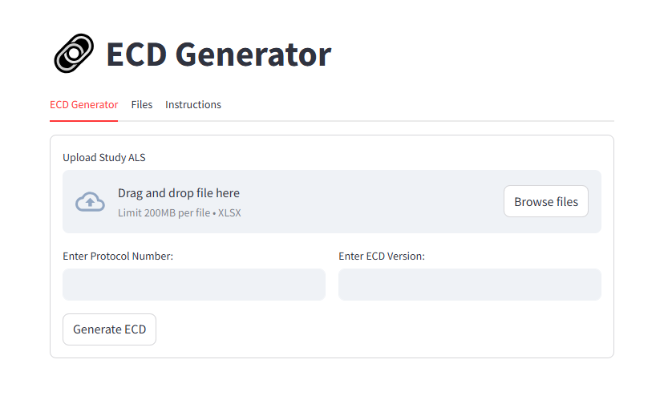
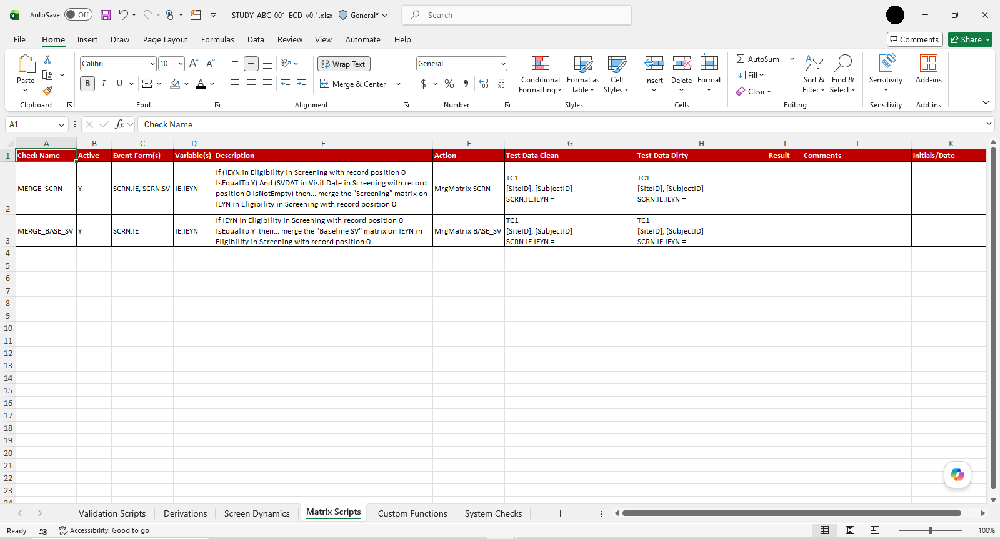

# ECD Generator — Architecture and Workflow

## Overview

This document provides a high-level view of the architecture and operational workflow of ECD Generator.

ECD Generator is a clinical study-build automation application that uses a Medidata Rave Architect Loader Spreadsheet (ALS) to generate a structured Excel workbook for UAT preparation.

The project was inspired by a similar automation approach observed in another clinical data environment and independently implemented for a different organizational workflow.

Implementation-specific processing rules, mappings, and generation logic are intentionally outside the scope of this public case study.

For the project overview, see the repository [README](../README.md).

---

## Workflow Context

UAT preparation for a Rave study build requires programmed study behavior to be translated into structured validation scripts.

The existing workflow relied on a Lead Data Manager reviewing the applicable study specifications and manually preparing the validation workbook before peer review and UAT execution.

```text
Study Build
     │
     ▼
Study Specifications
     │
     ▼
Manual Script Preparation
     │
     ▼
Peer Review
     │
     ▼
UAT Execution
```

For larger study builds, this preparation could require approximately one working day.

ECD Generator introduces an automated preparation step:

```text
Rave Study Build
       │
       ▼
Architect Loader Spreadsheet
       │
       ▼
┌───────────────────────────┐
│       ECD Generator       │
│                           │
│   Automated Preparation   │
└─────────────┬─────────────┘
              │
              ▼
     Generated ECD Workbook
              │
              ▼
         Human Review
              │
              ▼
         UAT Execution
```

The application automates preparation of the validation artifact while retaining human review and UAT execution.

---

## User Workflow

The application provides a lightweight Streamlit interface.



*ECD Generator interface for providing the Rave ALS, protocol number, and ECD version.*

The user:

1. uploads the Architect Loader Spreadsheet;
2. enters the protocol number and ECD version;
3. initiates generation; and
4. downloads the generated workbook.

No protocol-specific application configuration is required for compatible study builds.

---

## Architecture

ECD Generator separates the application into three high-level responsibilities:

```text
┌────────────────────────────┐
│       User Interface       │
│        (Streamlit)         │
└──────────────┬─────────────┘
               │
               ▼
┌────────────────────────────┐
│   Application Processing   │
│                            │
│  Study-build information   │
│            ↓               │
│   Validation content       │
└──────────────┬─────────────┘
               │
               ▼
┌────────────────────────────┐
│    Workbook Generation     │
│        (openpyxl)          │
└────────────────────────────┘
```

### User Interface

Streamlit handles file input, document-level information, generation requests, and delivery of the completed workbook.

### Application Processing

The processing layer interprets the supplied study-build information and generates the validation content required for the output workbook.


### Workbook Generation

The generated content is written into a predefined Excel workbook structure using `openpyxl`.

The application does not create, update, or deploy study metadata within Medidata Rave.

---

## Generated Workbook

The resulting workbook organizes validation content into six categories:

| Worksheet | Validation Area |
| --- | --- |
| **Validation Scripts** | CRF data-entry validation |
| **Matrix Scripts** | Visit and form workflow |
| **Screen Dynamics** | Dynamic form behavior |
| **Derivations** | Study data derivations |
| **Custom Functions** | Applicable custom-function-driven logic |
| **System Checks** | Field-level system validation |



*Example of the generated multi-sheet validation workbook using synthetic study information.*

The internal rules used to identify, interpret, and generate this content are not part of the public documentation.

---

## Cross-Study Design

ECD Generator was designed around compatible Rave study-build information rather than individual protocols.

```text
Study A ─┐
Study B ─┼──► ECD Generator ──► Study-Specific Workbook
Study C ─┘
```

This allows the same application workflow to be used across compatible studies without maintaining a separate implementation for each protocol.

The approach was successfully tested against multiple Rave studies.

---

## Human Oversight

ECD Generator automates validation-script preparation, not validation judgment.

The generated workbook remains subject to human review. Reviewers remain responsible for validation coverage, study-specific test data, additional scenarios where required, and assessment of UAT results.

The application therefore supports the controlled validation process rather than replacing it.

---

## Outcome

During testing:

| Manual Workflow | ECD Generator |
| --- | --- |
| Approximately one working day | Less than three minutes |
| Manual workbook preparation | Automated workbook generation |
| Study-by-study preparation | Reusable workflow across compatible studies |
| Human review | Human review retained |

ECD Generator was completed and successfully tested against multiple Rave studies.

The application was not incorporated into the operational workflow because the organization's study-build procedures had recently undergone significant changes, and adoption would have required another round of process updates.

---

## Technology

- **Python**
- **Pandas**
- **Streamlit**
- **openpyxl**
- **Microsoft Excel**

---

## Scope

ECD Generator is presented publicly as a portfolio case study rather than an implementation specification.

The public documentation covers the application's purpose, workflow, conceptual architecture, output structure, and demonstrated outcome.

It intentionally excludes production source code, generation algorithms, metadata mappings, processing rules, proprietary study information, and organization-specific implementation details.

Representative synthetic materials are available in [`samples/`](../samples/).